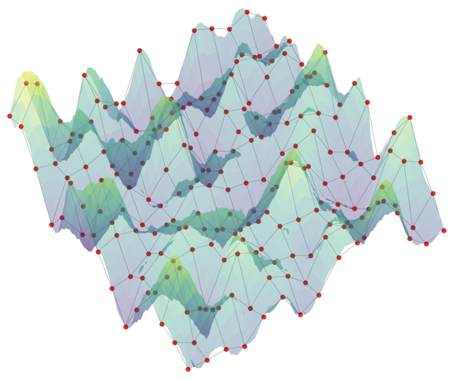
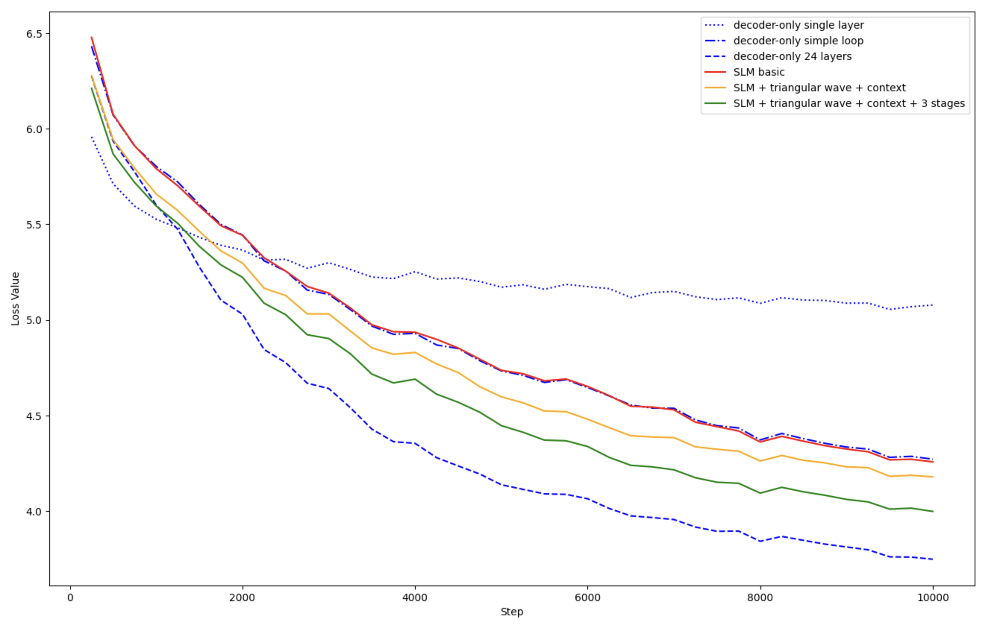

# LoopSLM

The repository contains a set of modules for building and experimenting with **LoopSLM** - a Small Language Model (SLM) architecture aiming to minimize training VRAM footprint and enable local execution.

The **LoopSLM** architecture consists of two core parts: a base decoder-only layer and a set of hypersurfaces used to generate the diffs ($\Delta W_l$) that are dynamically applied to the base weight matrices to produce the next layer's weights ($W_l = W_0 + \Delta W_l$).

# Model architecture

The model adopts an approach similar to the Universal Transformer (UT), iterating inputs through a shared base layer $L$ times. Unlike the UT, which injects step/depth embeddings directly into the hidden states, **LoopSLM** modifies the base layer’s weights at each pass using layer-specific weight deltas. The weight deltas ($\Delta W_l$) are sampled from cross-sections of continuous hypersurfaces. Additionally, the model tracks input sequence context using a Gated Linear Attention (GLA) state vector, which dynamically modulates the geometry of the hypersurfaces.

## 1. Hypersurfaces

### 1.1 Overview

Take a 2D weight matrix. You can map it into a 3D coordinate space: plot the row index on the X-axis, the column index on the Y-axis, and the weight value on the Z-axis, and you'll get a grid of points in 3D space. These points could be approximated with a continuous 3D surface.

Stacking the weight matrices of equivalent components across all layers (e.g. the Attention Query matrix ($W_q$) from layer 1 all the way through layer $L$) creates a 3D parameter tensor (rows $\times$ columns $\times$ layer depth). In turn, this tensor can be mapped into a 4D coordinate space, so this entire stack can be approximated by a single continuous 4D hypersurface. Slicing it along the layer-depth axis recovers the weight matrix for any specific layer.

Replacing all parameters entirely with hypersurfaces proved too restrictive and failed to converge during training. Instead, **LoopSLM** keeps a shared base layer ($W_0$) and uses hypersurfaces to generate layer-specific weight deltas ($\Delta W_l$). To get the final weight matrix for any layer $l$, you simply add its delta to the base:

$$W_1 = W_0 + \Delta W_1$$
$$W_2 = W_0 + \Delta W_2$$
$$...$$
$$W_l = W_0 + \Delta W_l$$

*Note: While we describe a single loop here for simplicity, the model architecture isn't restricted to just one layer—you can stack multiple distinct looping blocks, each with its own base weights and hypersurface delta generators.*

These delta surfaces can be constructed using different functional bases, such as standard sine harmonics or triangular waves. While both work, experiments showed that the triangular wave produces slightly better training results.

### 1.2 Constructing delta surfaces

The surface landscape is constructed in three steps:

1. **1D Harmonic Waves:** For each dimension (row $r$, column $c$, layer depth $d$, and matrix selector $s$), the model generates 1D triangular waves ( $\text{Tri}_i(\text{dim})$ ) with learnable frequencies and phases.

2. **N-D Surface Components:** Multiplying the 1D wave values across all dimensions creates a single multi-dimensional surface component:

$$\text{Surface}_i(r, c, d) = \text{Tri}_i(r) \cdot \text{Tri}_i(c) \cdot \text{Tri}_i(d)$$

3. **Sum of Harmonics:** Stacking $E$ of these components (the expansion order) scaled by learned amplitudes ($A_i$) builds the complete hypersurface:

$$\Delta W(r, c, d) = \sum_{i=1}^{E} A_i \cdot \left(\text{Surface}_i(r, c, d) \right)$$

By sampling this continuous space at fixed discrete coordinates $(r_l, c_l, d_l)$ for layer $l$, the model extracts a weight diff $\Delta W_l$ that modifies the shared base layer.

## 2. Context vector

To allow the shared base layer to adapt to complex sequences, input token embeddings pass through a sequence-aware recurrent tracker accelerated by Triton GLA (Gated Linear Attention). The resulting state is projected and normalized into a dynamic multiplier:

$$\text{multiplier} = 1.0 + \text{state}$$

This multiplier is then used to modulate the hypersurface amplitudes.

# Training results

To validate the architecture, pre-training experiments were conducted on a 10B-token sample from the FineWeb-Edu dataset. Documents were concatenated using end-of-sequence tokens and packed into 1024-token sequences, with intra-document attention masking to prevent cross-document leakage.

To keep parameter count minimal and focus training directly on the delta-generator dynamics, the model uses pre-trained, frozen embeddings from GPT-2 along with weight tying (sharing the embedding matrix with the final output head).

The plot below shows the training results.

* **decoder-only single layer** - standard 1-layer decoder-only transformer baseline
* **decoder-only simple loop** - single-layer transformer unrolled across 24 loop iterations with static shared weights (no delta surfaces)
* **decoder-only 24 layers** - standard 24-layer decoder-only transformer with unique parameters per layer
* **SLM basic** - single loop block using sinusoidal surface deltas without context modulation
* **SLM + triangular wave + context** - single loop block using triangular surface deltas with dynamic GLA context modulation enabled
* **SLM + triangular wave + context + 3 stages** - three stacked loop blocks, each utilizing triangular surface deltas and GLA context modulation[^1]

[^1]: Inspired by the ["LLM Neuroanatomy" blog post](https://dnhkng.github.io/posts/sapir-whorf/), the multi-stage model uses three dedicated looping blocks to conceptually divide depth into decoding, reasoning, and encoding phases. This gives each functional region its own base layer and hypersurface parameter space while maintaining parameter efficiency.
